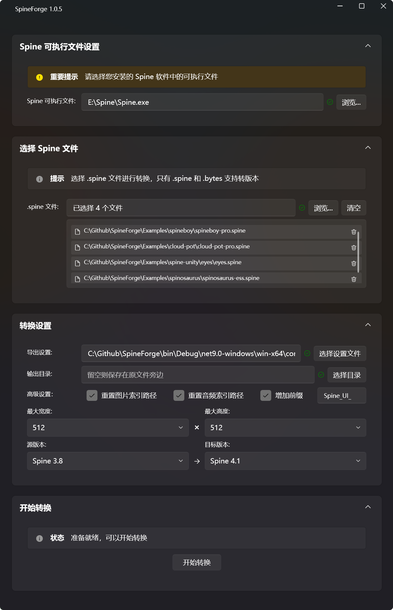

# SpineForge

[中文](#中文) | [English](#english)

---

## 中文

### 项目简介

SpineForge 是一个专业的 Spine 动画资产批量处理工具，专为游戏开发者设计。它能够规范化处理 Spine 文件，确保导出的资产符合游戏引擎的标准格式要求，支持批量转换和数据清理功能。

### 主要特性

- **多版本支持**：支持 Spine 3.6 - 4.2 版本
- **批量处理**：一键批量导出多个 Spine 项目
- **格式标准化**：自动清理和规范化 JSON 数据格式
- **双格式导出**：支持 JSON 和二进制 (.skel) 格式导出
- **现代界面**：基于 WPF 的直观用户界面
- **配置管理**：可保存和管理导出设置

### 支持的 Spine 版本

- Spine 4.2
- Spine 4.1  
- Spine 4.0
- Spine 3.8
- Spine 3.7
- Spine 3.6

### 系统要求

- **操作系统**：Windows 10/11
- **必需软件**：正版 Spine 软件
- **运行时**：无需额外安装 .NET（已打包为独立可执行文件）

### 快速开始

1. **下载**：从 [Releases](../../releases) 页面下载最新版本的 `SpineForge.exe`
2. **安装**：无需安装，直接运行可执行文件
3. **配置**：首次运行时配置 Spine 软件路径
4. **使用**：拖拽 Spine 项目文件或选择文件夹开始批量处理

### 使用场景

- 游戏项目中需要批量处理 Spine 动画资产
- 确保导出资产符合特定游戏引擎要求
- 清理和优化 Spine 导出的 JSON 数据
- 统一团队的 Spine 资产导出标准

### 项目结构

- **Config/** - 配置文件
- **Converters/** - 数据转换器
- **Models/** - 数据模型
- **Services/** - 业务服务
- **ViewModels/** - 视图模型
- **Views/** - 用户界面
- **Resources/** - 资源文件
- **Examples/** - 测试示例文件（来自 Spine Runtime）
- **Utils/** - 工具类

### 技术栈

- **框架**：WPF (.NET 9.0)
- **架构**：MVVM
- **UI库**：WPF UI
- **依赖注入**：Microsoft.Extensions.DependencyInjection

### 许可证与法律声明

- 本项目需要配合正版 Spine 软件使用，请确保您拥有有效的 Spine 许可证
- 项目中的示例文件来自 [Spine Runtime Examples](https://github.com/EsotericSoftware/spine-runtimes)，仅用于测试和演示目的
- 使用本工具处理的任何 Spine 资产都需要遵守 Spine 软件的许可证条款

### 贡献

欢迎提交 Issue 和 Pull Request！

---

## English

### Project Description

SpineForge is a professional batch processing tool for Spine animation assets, designed specifically for game developers. It standardizes Spine file processing to ensure exported assets meet game engine format requirements, with support for batch conversion and data cleaning functionality.

### Key Features

- **Multi-version Support**: Supports Spine versions 3.6 - 4.2
- **Batch Processing**: One-click batch export of multiple Spine projects
- **Format Standardization**: Automatic cleaning and standardization of JSON data formats
- **Dual Format Export**: Supports both JSON and binary (.skel) format export
- **Modern Interface**: Intuitive WPF-based user interface
- **Configuration Management**: Save and manage export settings

### Supported Spine Versions

- Spine 4.2
- Spine 4.1
- Spine 4.0
- Spine 3.8
- Spine 3.7
- Spine 3.6

### System Requirements

- **Operating System**: Windows 10/11
- **Required Software**: Licensed Spine software
- **Runtime**: No additional .NET installation required (packaged as standalone executable)

### Quick Start

1. **Download**: Download the latest `SpineForge.exe` from the [Releases](../../releases) page
2. **Installation**: No installation required, run the executable directly
3. **Configuration**: Configure Spine software path on first run
4. **Usage**: Drag and drop Spine project files or select folders to start batch processing

### Use Cases

- Batch processing of Spine animation assets in game projects
- Ensuring exported assets meet specific game engine requirements
- Cleaning and optimizing JSON data exported from Spine
- Standardizing team Spine asset export workflows

### Project Structure

- **Config/** - Configuration files
- **Converters/** - Data converters
- **Models/** - Data models
- **Services/** - Business services
- **ViewModels/** - View models
- **Views/** - User interfaces
- **Resources/** - Resource files
- **Examples/** - Test example files (from Spine Runtime)
- **Utils/** - Utility classes

### Tech Stack

- **Framework**: WPF (.NET 9.0)
- **Architecture**: MVVM
- **UI Library**: WPF UI
- **Dependency Injection**: Microsoft.Extensions.DependencyInjection

### License & Legal Notice

- This project requires use with licensed Spine software. Please ensure you have a valid Spine license
- Example files in this project are from [Spine Runtime Examples](https://github.com/EsotericSoftware/spine-runtimes), used for testing and demonstration purposes only
- Any Spine assets processed with this tool must comply with Spine software license terms

### Contributing

Issues and Pull Requests are welcome!

### Contact & Support

If you encounter any issues or have suggestions, please feel free to create an issue in this repository.
